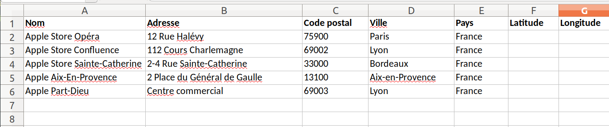
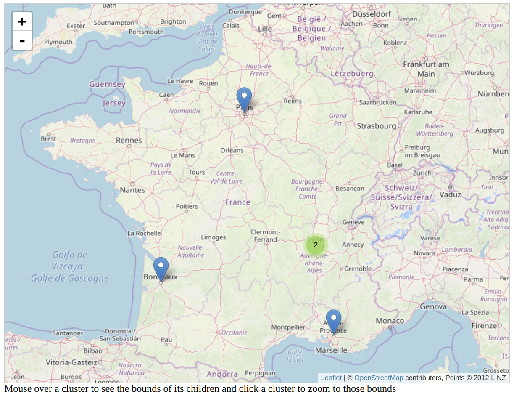

# Store Locator 

This project contain python code to query coordinates from adresses via Google maps api or Geocode Nomatim, and leaftlet library to draw marker on a map.

## Coordinates query


This script add Latitude and Longitude to the xls file and generate resellers.js for leaftlet map.

### Requirements

```
pip install xlrd
pip install xlutils
```
and
```
pip install googlemaps
```
or 
```
pip install geopy
```

### Launch

Set your var and api key and launch:
```
python getLatLongGoogleMaps.py
python getLatLongNomatim.py
```

## leaflet maps



### Marker-clustering

Leaflet marker clusturing is a submodule from https://github.com/Leaflet/Leaflet.markercluster

#### Requirements

Inside Leaflet.markercluster
```
npm install -g jake
cd  Leaflet.markercluster
npm install
```

#### Demo

Open marker-clustering-resellers.html in your browser
